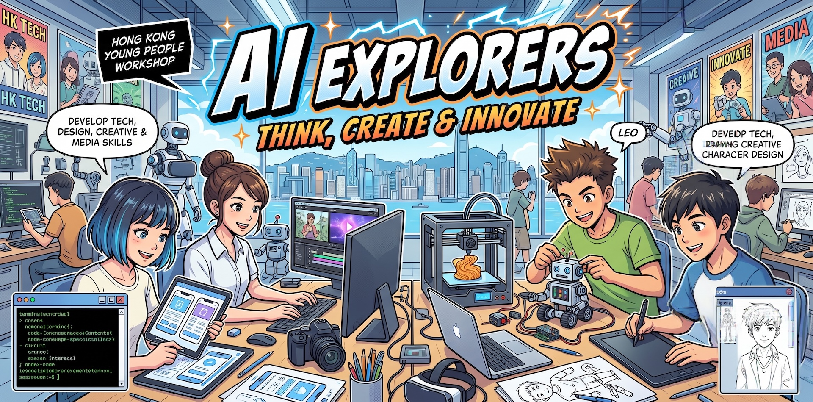
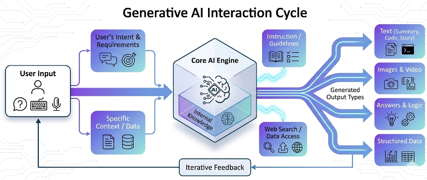
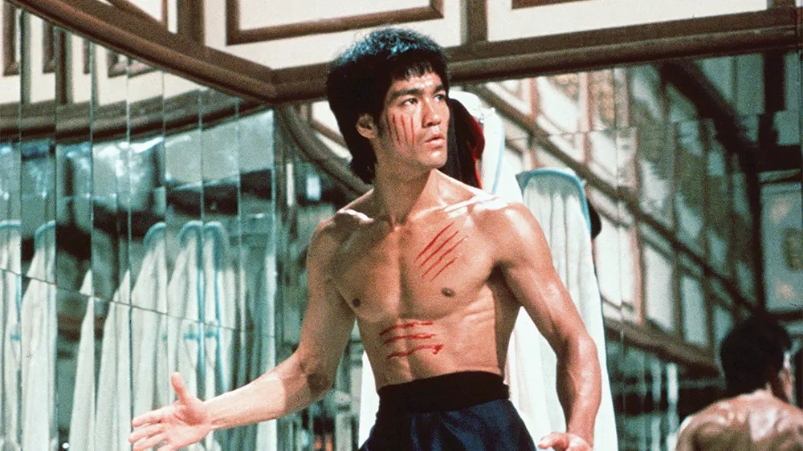
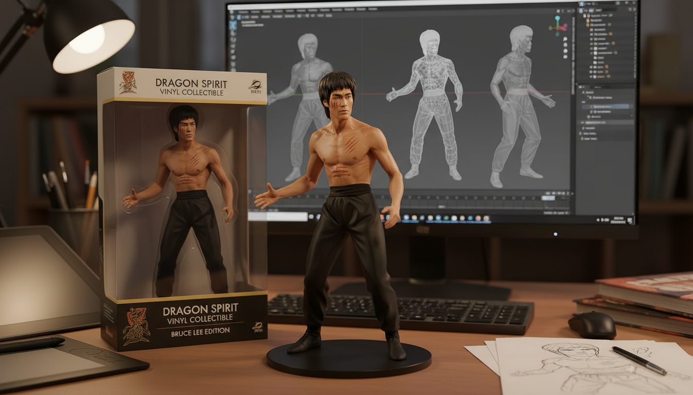
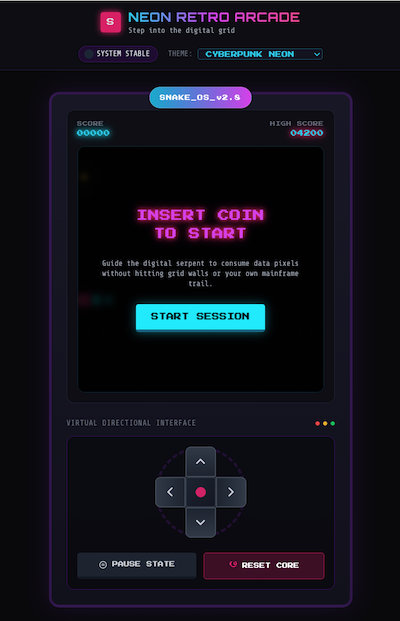
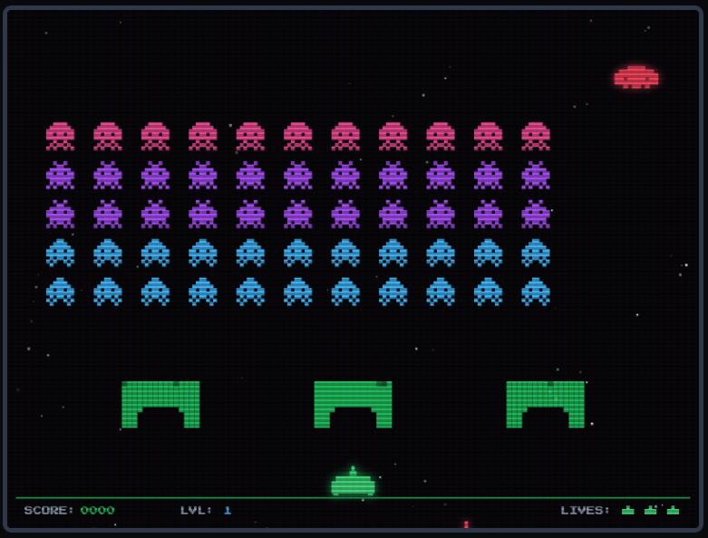
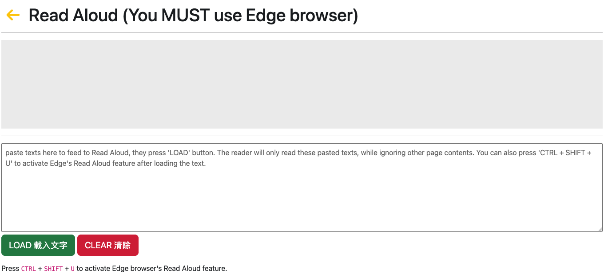

# AI Explorers: Think, Create & Innovate



This page contains the AI resources and Generative AI prompts for students to explore the world of Artificial Intelligence (AI) and its applications in design, creativity, critical thinking, and digital innovation. Students will learn how to use AI to create images, videos, music, and interactive content. Students will also learn how to use AI tools to enhance their learning and develop skills for the future.

# How We Order GenAI to Work for Us



**Multimodal GenAI** models like Google Gemini can understand/process/generate various types of information, including text, images, audio, and video. This allows users to interact with the AI in a more natural and intuitive way, using different modes of communication to achieve their desired outcomes.

# Image Generation and Image Editing

## VisualGPT


VisualGPT is a powerful AI tool that can generate images based on text prompts. It can create stunning visuals, edit existing images, and even generate new images from scratch. With VisualGPT, students can unleash their creativity and bring their ideas to life through images.

One amazing image editing feature of VisualGPT **Room Cleaner**. It removes all the furniture and objects from a room, leaving only the walls, floor, and ceiling. This can be useful for interior design, home renovation, or just for fun. This is a complex task if done in Photoshop in the old way.


Let's have some fun at [https://visualgpt.io/](https://visualgpt.io/)

## Google Nano Banana


Nano Banana is Google's powerful image generation and editing tool that allows users to create and modify images with ease.

To use Nano Banana, just go to [https://gemini.google.com/](https://gemini.google.com/app) and choose **Create image** from the chat window and input your prompt.

---

**Popular Nano Banana 3D Character Prompt**

```
Turn this photo into a character figure.
Behind it, place a figure box with the character image printed on it,
and a computer showing the Blender modeling process on its screen.
In front of the box, add a round plastic base with the figure placed on it.
Use the figure's vinyl material.
Set the scene in home studio
```





---

## Applying camera language to the prompt

```
a little girl, facing camera, reaching out to an apple on a coffee table.
```


---

```
a little girl, facing camera, reaching out to an apple on a coffee table.
use wide angle effect so that the apple appears very large on screen.
```


---

```
a little girl, facing camera, reaching out to an apple on a coffee table.
top camera view.
```


---

## Visual Ingredients for Effective Image Generation

To create an effective prompt for AI image generation, focus on these visual "ingredients" to ensure a high-quality, coherent result:

- **Subject**: Define the main focus (e.g., a person, an object, a specific landscape).
- **Action/Interaction**: Describe what the subject is doing or how they relate to the environment.
- **Environment/Setting**: Specify the location, background, and surroundings.
- **Composition & Camera Angle**: Determine the perspective (e.g., wide shot, close-up, top-down, eye-level).
- **Lighting**: Define the mood via light (e.g., cinematic lighting, golden hour, soft diffuse light, dramatic shadows).
- **Artistic Style/Medium**: Set the aesthetic (e.g., hyper-realistic photography, oil painting, 3D render, minimalist vector art).
- **Color Palette**: Specify the dominant colors or color mood (e.g., warm earthy tones, monochromatic, vibrant neon).
- **Level of Detail**: Indicate the visual quality (e.g., intricate details, 8k resolution, film grain, sharp focus).

# Fashion Design / Product Design

AI can also be a powerful tool for fashion design and product design. With AI, students can create new designs, explore different styles, and even generate prototypes.

Let's try [newarc](https://www.newarc.ai/)


# Video Generation

Video generation is an exciting area of AI that allows users to create videos from text prompts or by feeding in still images. With AI video generation tools, students can bring their stories to life, create engaging content, and explore new ways of storytelling.


The recent best tool is **Seedance**. With Seedance, students can unleash their creativity and bring their ideas to life through videos. Without AI, a video shooting scene may take a team hours or days to set up, but with Seedance, it can be done in minutes.

You can also try Yeri and Qwen. Both provide some free credits for users to try out the video generation features. The resolution will be low and the length is short, but it's a good start for students to explore the possibilities of AI video generation.

[Yeri AI](https://yeri.ai/)  


[Qwen](https://chat.qwen.ai/)  


Use One of the following prompts in any free video generation tool to experience video generation.

```
Hong Kong Victoria Harbour at sunset, cinematic,  dynamic.
```

---

```
Hong Kong Causeway Bay, pedestrians walk on busy street, cinematic, dynamic.
```

# Music Generation


Suno is a powerful AI music generation tool that allows users to create music from text prompts. Suno can generate music in various genres and styles, making it a versatile tool for music creation.

Let's have some fun at [https://suno.com/](https://suno.com/)

Use of the following prompts in Suno or other music generation tools.

```
A relaxed 90s-style lo-fi hip-hop beat. Features a dusty, crackling vinyl effect, a smooth and jazzy electric piano chord progression, and a laid-back, mellow drum groove. Perfect for studying or relaxing. Tempo: 75 BPM. Mood: nostalgic, cozy, and calm.
```

---

```
A high-energy, modern synth-pop track with a driving electronic bassline, bright 80s-style synthesizers, and an upbeat, danceable four-on-the-floor drum rhythm. Upbeat, celebratory, and infectious energy. Tempo: 120 BPM. Mood: euphoric, confident, and fun.
```

---

```
A sweeping, cinematic orchestral track for a sci-fi film. Starts with a quiet, mysterious ambient synth and slow strings, then builds up to a powerful, epic climax with heavy brass, driving percussion, and a sense of awe. Tempo: slow to fast build-up. Mood: wondrous, heroic, and grand.
```

---

```
A dark, futuristic synthwave track with a heavy, pulsating bassline, fast-paced retro drum machines, and neon-vibe lead synths. Reminiscent of a high-speed car chase through a rain-slicked cyberpunk city at night. Tempo: 110 BPM. Mood: gritty, intense, and driving.
```

---

```
一首用于科幻电影的、气势磅礴的交响乐曲。以安静、神秘的氛围合成器和舒缓的弦乐拉开序幕，随后逐渐增强，加入厚重的铜管乐、激昂的打击乐，最终推向一个充满震撼与敬畏感的史诗级高潮。节奏：由慢至快的渐强。情绪：惊叹、英雄主义、宏大。
```

---

# Vibe Coding

Vibe coding is a new way of coding that uses AI to generate code based on natural language prompts. With vibe coding, students can write code in a more intuitive and creative way, without having to worry about syntax or technical details.

Here are some professional vibe coding tools on the market

- Claude Code
- Github Copilot
- Lovable

Let's try using Google Gemini to generate a simple web application using the following prompts.

```
create a lucky draw simple webpage that generate a random number between 1000 and 2000.  Use black background color and orange big text for the generated number.  Clean and minimal design style.
```

# Interactive Content Generation

In Gemini, you can choose Canvas output type and it will generate codes that can run interactively right there inside gemini chat interface or you can copy the source code to your local IDE and further develop it. You can also easily share the generated interactive content with your friends by sharing the URL of the canvas app.

```
show a simple matrix calculation using html5 animation
```

---

```
generate a simulation to teach students about bubble sort for data structures and algorithm introduction
```

# Games Generation

Use the following prompts in Google Gemini to generate simple games.

**Prompts # 1**

```
Act as a creative programmer. Write a classic grid-based Snake game
Requirements:
1. The snake moves continuously on a grid and can change directions using the arrow keys (preventing 180-degree immediate self-collision).
2. Randomly spawn "food" pixels that grow the snake's length and increase the score when eaten.
3. The game ends if the snake crashes into the screen boundaries or its own tail.
4. Implement a high-score tracker using local storage so it persists across refreshes.
5. Use a nostalgic, monochromatic green-screen (Game Boy style) or cyberpunk neon theme.
```

Here is a pre-generated Gemini Canvas app by me.

[Snake Game](https://gemini.google.com/share/e66b5b9d9e7c)  


---

**Prompts # 2**

```
Act as a game developer. Create a classic 2D space shooter game inspired by Space Invaders

Requirements:
1. Player controls a spaceship at the bottom (moves left/right, spacebar to shoot).
2. A grid of alien ships at the top that moves horizontally and shifts downward whenever they hit the screen edge.
3. Aliens should occasionally fire projectiles downward at the player.
4. Include 3 destructible defense bunkers between the player and the aliens.
5. Track the score and player health.
6. Use a retro arcade aesthetic with a starry background effect (scrolling or blinking pixels).
```

[Spaceship Game](https://gemini.google.com/share/266623b04e8c)


---

**Prompts # 3**

```
Act as a seasoned game designer. Create an infinite side-scrolling runner game, reminiscent of classic 8-bit platformers, contained entirely within one HTML file.

Requirements:
1. The player controls a pixelated character that runs automatically to the right. Pressing 'Space' or 'Up Arrow' makes the character jump.
2. Implement basic gravity and jumping physics so the jump feels smooth, not floaty.
3. Procedurally generate obstacles (like spikes or pits) moving from right to left that the player must avoid.
4. The score should increase based on distance traveled (survived time).
5. Design it with a cool retro synthwave aesthetic (dark background, pink/cyan accents).

Deliver the complete, fully commented code inside a single HTML structure.
```

---

# AI Tools for Self Learning

[Read Aloud in Microsoft Edge](https://training.imagenation.com.hk/edge-reader.html)  


Gemini Gems


# Mastering RICE FACT Effective Prompting

RICE FACT is a useful framework to help you structure your prompts effectively when using AI tools. It stands for Role, Instruction, Context, Example, Format, Action, Constraint, and Tone. By incorporating these components into your prompts, you can guide the AI to generate more accurate and relevant responses.

**Beginner Pitfall**: AI beginner users tend to use simple Instruction-only prompts, which often lead to vague and irrelevant responses. By adding more prompt components such as Role, Context, Example, Format, Action, Constraint, and Tone, you can significantly improve the quality of the AI's responses.


**Tips 1**: You can just click the copy button to replicate the prompt in your AI ssistant. It's OKAY to include the RICE FACT tags in your prompt.  
**Tips 2**: In your future prompting, You DON'T actually have to specifically add these tags in your prompts. They are just there to help you better understand the prompt structure.  
**Tips 3**: It's NOT common to include all RICE FACT components in a single prompt.

**Instruction** only

```
Role        →
Instruction → Explain what GenAI is.
Context     →
Example     →
Format      →
Action      →
Constraint  →
Tone        →
```

---

**Instruction** + **Format**

```
Role        →
Instruction → Explain what GenAI is.
Context     →
Example     →
Format      → Use one sentence.
Action      →
Constraint  →
Constraint  →
```

---

**Role** + **Instruction** + **Format**

```

Role        → You are a secondary teacher.
Instruction → Explain what GenAI is.
Context     →
Example     →
Format      → Use one sentence.
Action      →
Constraint  →
Tone        →

```

---

**Role** + **Instruction** + **Format**

```

Role        → You are a kindergarten teacher.
Instruction → Explain what GenAI is.
Context     →
Example     →
Format      → Use one sentence.
Action      →
Constraint  →
Tone        →

```

---

**Role** + **Instruction** + **Context**

```

Role        → You are a secondary teacher.
Instruction → Explain what GenAI is.
Context     → The target audience are non-ICT students.
Example     →
Format      →
Action      →
Constraint  →
Tone        →

```

---

**Instruction** + **Format**

```
Role        →
Instruction → Explain what GenAI is.
Context     →
Example     →
Format      → Use three bullet points.
Action      →
Constraint  →
Tone        →
```

---

**Instruction** + **Format** + **Constraint**

```
Role        →
Instruction → Explain what GenAI is.
Context     →
Example     →
Format      → Use three bullet points.
Action      →
Constraint  → Each bullet points not more than 15 words.
Tone        →
```

---

**Instruction** + **Example**

```
Role        →
Instruction → Generate 10 dummy customer records as below
Context     →
Example     → CustID, CustName, Email, Mobile, Address
Format      →
Action      →
Constraint  →
Tone        →
```

---

# AI Ethics and Responsible AI


As students explore the world of AI, it's important to also learn about AI ethics and responsible AI practices. This includes understanding the potential biases in AI models, the importance of data privacy, and the ethical implications of AI in society.

# Popular GenAI Tools

- [Gemini](https://gemini.google.com) - Google Gemini is a powerful, multimodal large language model developed by Google that can understand and process a wide range of information, including text, images, audio, and video.
- [Perplexity](https://www.perplexity.ai) - AI search engine that provides concise answers with sources.
- [Microsoft Copilot](https://copilot.microsoft.com/) - Free Microsoft AI assistant.
- [Grok](https://grok.com) - AI tool for generating text and code.
- [Qwen](https://chat.qwen.ai) - Conversational AI for various tasks
- [DeepSeek](https://www.deepseek.com) - Conversational AI for various tasks (**NOT** a multi-modal tool)
- [Poe](https://poe.com) - Platform to access multiple AI models in one place.
- [VisualGPT](https://visualgpt.io) - Photo Editor with AI / Image Generation
- [LMArena](https://lmarena.ai) - Compare and explore different large language models.
- [Notion AI](https://www.notion.com) - Note-taking and productivity app with AI features.
- [Canva](https://www.canva.com) - Graphic design platform with AI-powered tools. Great for Power Point Generation.

# More on Popular GenAI Tools

- [Microsoft 365 Copilot](https://m365.cloud.microsoft/) - AI assistant integrated into Microsoft 365 apps.
- [ElevenLabs](https://elevenlabs.io) - AI-powered text-to-speech platform.
- [narakeet](https://www.narakeet.com/languages/chinese-text-to-speech/) - Easily Create Voiceovers Using Realistic Text to Speech
- [Cleanvoice AI](https://cleanvoice.ai) - Audio editing tool that removes filler words, stutters, and long pauses from audio recordings.
- [Stable Diffusion](https://stablediffusionweb.com) - Open-source image generation model.
- [Kling AI](https://app.klingai.com) - AI-powered video creation platform.
- [Hailuo AI](https://hailuoai.video) - AI-powered video creation platform.
- [Runway](https://runwayml.com) - AI-powered video editing and creation
- [newarc](https://www.newarc.ai/) - AI-powered fashion creative platform.
- [Tripoai](https://studio.tripo3d.ai) - AI-powered 3D content creation platform.
